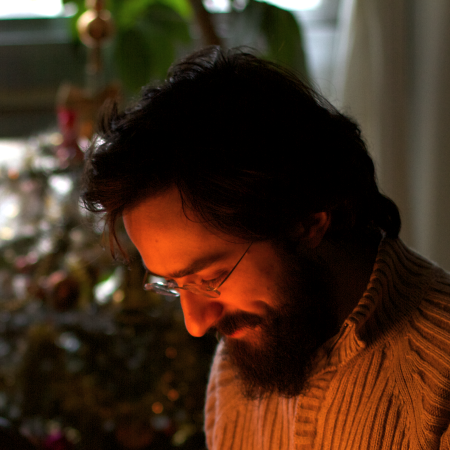

## About

I'm a French knowledge seeker who loves to learn, in order to gain
greater understanding.  And as knowledge is gained, my ignorance
widens, which in turn leads to more learning.

I'm interested in the following subset topics of computer science:
programming, languages, algorithms, structures, idioms, tricks.  When
I'm not reading a book or a web article on one of these topics, I'm
most likely building something to scratch an itch, or just tinkering.
Or resting.  I do that too.  Beside walking, I also enjoy most forms
of modern entertainment: music, cinema, literature and gaming.

I'm a strong proponent of free software and open knowledge.  As a
testimony to that, you are free to browse, modify and reuse the
[source code for this site][source], which is powered by [Jekyll][].
Unless otherwise noted, all content on this site is licensed under a
[Creative Commons Attribution-ShareAlike 3.0 Unported License][cc-by-sa].

I'm currently a PhD student in Computer Science at
[École des Mines de Nantes][emn], and globally having fun.

Florent Marchand de Kerchove de Denterghem

fmdkdd at gmail

<a href="http://github.com/fmdkdd/">github/fmdkdd</a>

[emn]: http://www.mines-nantes.fr/
[source]: http://www.github.com/fmdkdd/fmdkdd.github.com
[Jekyll]: http://jekyllrb.com/
[cc-by-sa]: http://creativecommons.org/licenses/by-sa/3.0/
