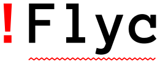

## Projects

Here are few things I have made or have contributed to.  They are roughly in
reverse chronological order of involvement.

[flycheck][], a GNU Emacs plugin for syntax-checking code and reporting
diagnostics in the buffer.  I've been helping around as a co-maintainer since
the original author's departure.  It has support for over 40 different
programming languages, and is one of most-downloaded Emacs plugin on [MELPA][].

[megado][], a MegaDrive emulator in C made by [merwaaan][].  It has nice
debugging features, snapshots, and is starting to play quite a few games, albeit
with glitches.  I'm helping around with infrastructure: making it builds on
Linux, continuous integration, sanitizers and the like.  At some point I should
start working on sound emulation.

[Bright Plateau][], a short puzzle game made in 72 hours for the Ludum Dare 39
jam, in duo with [merwaaan][].  You have to power up houses by placing
generators on the plateau.  This time we went 3D with [THREE.js][], and,
although exhausted, we were quite satisfied with how the game turned out.  I
wrote a [post-mortem][] about it.

[boyo.js][], a GameBoy emulator in JavaScript made by [merwaaan][].  I
implemented the audio emulation, improved the performance so that it would run
decently in Firefox and Chrome, and helped with miscellanea.  I love hearing the
intro to Link's Awakening on it.

[gbs][], a GameBoy Sound player written in Rust.  My first attempt at GameBoy
audio emulation for [boyo.js][] was a mess, and I started from scratch in Rust.
Once I got it working there, I ported it to JS.  It's not an actual player: it
just writes GBS input files to WAV.  It doesn't play all GBS files and the sound
quality could be better, but it's mine.

[chipers][], another CHIP-8 emulator written in Rust.  I figured Rust would be a
better fit for writing emulators than JavaScript; the FPS counter confirms it.
I added a debugging interface with [dear imgui][] and a fancy CRT shader that's
actually credible this time (but still slow).

[chip8][], a CHIP-8 emulator written in JavaScript.  I wanted to get a better
grasp of writing an emulator for a complete system.  Although the CHIP-8 is not
a real console, getting it working got me hooked on writing emulators.  I added
a CRT emulation effect to make it interesting, but it's not really convincing,
and actually quite slow.

[You Are The Münster][], another Ludum Dare game, made in duo with [merwaaan][].
The theme was "You are the monster", and... well, the pun was too tempting.
It's a platform game with unlockables (à la Metroid), though we only had the
time to put two areas in the game.  The art is much better than my previous solo
attempt (because I made only half of it!), and there's even a homemade
background music this time.  Jumping can be a bit frustrating at times, so we
added checkpoints.

[LD48][], a game made solo, in parallel to the Ludum Dare 29 week-end, but not
part of the competition.  It started as a minimalist action-RPG, but I had too
much fun and added homemade pixel art and sound effects.  Now it's neither
minimalist, nor particularly fun.  Still had a good time making it.

[webppm][], a PPM viewer for the web.  Drag and drop a PPM file, use the slider
to zoom.  Made for my students after I couldn't find a decent multi-platform PPM
viewer.

[s3c][], a JavaScript editor with code evaluation built for the students of the
introductory JavaScript courses I taught at Mines Nantes.  You can edit and
evaluate the whole buffer for immediate feedback.  The point is to save setup
time (you only need a browser) and to focus on JavaScript snippets (not
full-blown apps).  Still my go-to solution when I want to test a bit of JS code.

[bump][], a satirical productivity hack.  Click every time you finish a task,
and bask in the glory of your achievements.  The original version was made
during my research internship at my University and had a scoreboard with the
names of all the interns.  It only works if you believe in it.

[Sparkets][], a multiplayer space shooter made for HTML5 browsers.  Inspired by
the games Spacewar! and Slingshot, it started as a toy to learn HTML5 Canvas
API, node.js and WebSockets.  Together with [merwaaan][], we kept adding
features and playing the hell out of it.  Never got to a shippable state, but
it's still pretty fun.

[Laby-o-matic][], a maze generator made as an assignment for a graph theory
course.  It generates paths that are usually quite long, but with few deep
branches, so they are not hard to solve.  Though it can generate different
shapes for the mazes, so at least they are pretty to look at.

[Monte-Carlo Connect Four][].  I read that Monte-Carlo methods were effective
for Go AIs.  I wondered how that worked and if that would make a decent
adversary for Connect Four.  Although it's not very strong, it still caught me
off-guard.  Plus, the algorithm was rather simple to write.

[shinkoban][], a Sokoban with sprites blissfully lifted from a famous SNES game.
This was initially a class assignment that I elaborated upon and polished in a
few days before applying for an internship at a local game company.  Got the
interview, not the job.  Still felt pretty good about this game.  The levels
were not mine, and they get pretty hard towards the end!

[Lectures notes][], taken during my Computer Science degree at the University of
Le Havre, in French.  I transcribed most of my math classes in LaTeX (live, save
for diagrams and hairy equations), and put them online for other students and
teachers to use.

See my [Github page][] for source code for all of the above, and other
one-shots.

[s3c]: /s3c/
[Sparkets]: https://github.com/fmdkdd/sparkets
[Lectures Notes]: http://fmdkdd.free.fr/
[Github page]: https://github.com/fmdkdd
[merwaaan]: https://merwanachibet.net
[LD48]: /ld48/
[You are the Münster]: /yatm/
[chip8]: /chip8/
[chipers]: https://github.com/fmdkdd/chipers
[dear imgui]: https://github.com/ocornut/imgui
[Monte-Carlo Connect Four]: /mcc4/
[Laby-o-matic]: https://github.com/fmdkdd/laby-o-matic
[bump]: /bump/
[webppm]: /webppm/
[boyo.js]: https://merwaaan.github.io/boyo.js/
[megado]: https://github.com/merwaaan/megado
[gbs]: https://github.com/fmdkdd/gbs
[flycheck]: http://www.flycheck.org/en/latest/
[MELPA]: https://melpa.org/
[shinkoban]: https://github.com/fmdkdd/shinkoban
[Bright Plateau]: /ld39/
[THREE.js]: https://threejs.org/
[post-mortem]: /2017/08/08/ludum-dare-post-mortem.html
